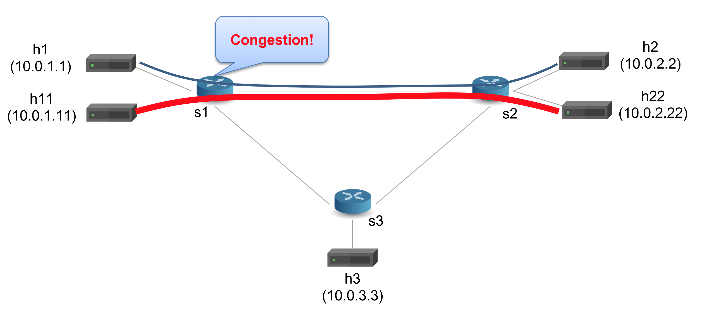

## quickstart


1. In your shell, run:
   ```bash
   make
   ```
   This will:
   * compile `mri.p4`, and
   * start a Mininet instance with three switches (`s1`, `s2`, `s3`) configured
     in a triangle. There are 5 hosts. `h1` and `h11` are connected to `s1`.
     `h2` and `h22` are connected to `s2` and `h3` is connected to `s3`.
   * The hosts are assigned IPs of `10.0.1.1`, `10.0.2.2`, etc
     (`10.0.<Switchid>.<hostID>`).
   * The control plane programs the P4 tables in each switch based on
     `sx-runtime.json`

2. We want to send a low rate traffic from `h1` to `h2` and a high
   rate iperf traffic from `h11` to `h22`.  The link between `s1` and
   `s2` is common between the flows and is a bottleneck because we
   reduced its bandwidth to 512kbps in topology.json.  Therefore, if we
   capture packets at `h2`, we should see high queue size for that
   link.



3. You should now see a Mininet command prompt. Open four terminals
   for `h1`, `h11`, `h2`, `h22`, respectively:
   ```bash
   mininet> xterm h1 h11 h2 h22
   ```
3. In `h2`'s xterm, start the server that captures packets:
   ```bash
   ./receive.py
   ```
4. in `h22`'s xterm, start the iperf UDP server:
   ```bash
   iperf -s -u
   ```

5. In `h1`'s xterm, send one packet per second to `h2` using send.py
   say for 30 seconds:
   ```bash
   ./send.py 10.0.2.2 "P4 is cool" 30
   ```
   The message "P4 is cool" should be received in `h2`'s xterm,
6. In `h11`'s xterm, start iperf client sending for 15 seconds
   ```bash
   iperf -c 10.0.2.22 -t 15 -u
   ```
7. At `h2`, the MRI header has no hop info (`count=0`)
8. type `exit` to close each xterm window

You should see the message received at host `h2`, but without any
information about the path the message took.  Your job is to extend
the code in `mri.p4` to implement the MRI logic to record the path.
